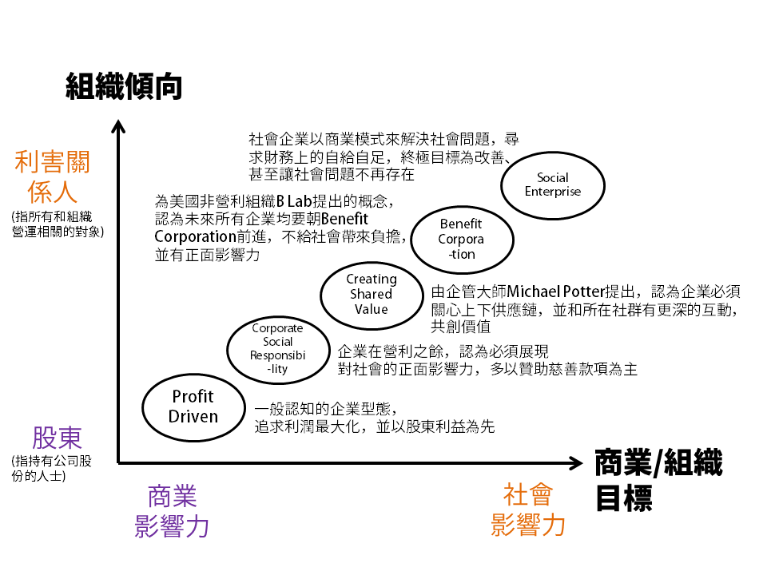

## 20181022#1: Introduction

### [Preview materials]

- [How to be a social entrepreneur?](https://youtu.be/N8LVa9pb-n8) (by A. Stoll, 18 min - * from minute 7:30)
- [Social entrepreneurs: Pioneering social change](https://youtu.be/jk5LI_WcosQ) (9 min*)
- [Changing the world through social entrepreneurship](https://youtu.be/Vvq9YgoJabY) (by W. Verloop, 13 min - start watching at minute 6:30)
- [Social Entrepreneurship: The case for definition](http://www.ngobiz.org/picture/File/Social%20Enterpeuneur-The%20Case%20of%20Definition.pdf)

### [Notes]

####1. 社企定義與發問

- Social entrepreneur (n.) a person who tries to solve social problems using entrepreneurial skills.

  -  “**Social Entrepreneur** is not a traditional job, so you have to throw out all of the traditional questions,” Stoll says. “The traditional questions you ask yourself—that I asked myself when I was in your seat as a student—were these two big questions that freak out a lot of people. **What do I want to be when I grow up?** What am I going to do when I graduate?’ Let’s just get rid of those questions altogether, because I’ve got a better question. If you want to change the world, if you want to do social entrepreneurial work…the real question is **what problem do you want to solve in the world?** What problem out there just pisses you off? What problem makes you say, ‘Wow that’s frustrating. Why does that even happen?’ That’s how you become a social entrepreneur.”

| Article   | [6 steps to becoming a successful social entrepreneur](https://www.weforum.org/agenda/2018/08/6-steps-to-become-a-successful-social-entrepreneur/) | [5 Clever Hacks for Becoming a Social Entrepreneur](https://www.forbes.com/sites/ericaswallow/2012/05/08/social-entrepreneurship/#2e90f87c71ca) |
| :-------- | ------------------------------------------------------------ | ------------------------------------------------------------ |
| **steps** | **1. Find your passion** **2. Build a team culture** **3. Get started** **4. Keep at it (how to stay motivated and persevere in difficult times)** **5. Fund your venture & grow organically** **6. Scale up** | **1. Identify a Social Problem** **2. Sign Strategic Partnerships** **3. Run It as a Business** **4. Make It Fun**  **5. Stay Committed** |

#### 2. 社會企業分類

- 台灣常用的社會企業分類：用商業模式解決社會問題，依據組織傾向和商業/組織目標繪製出第一象限的知覺定位圖如下。

### [Case study]

- Muhammed Yunus and the Grameen Bank

  - [窮人的銀行家 - 淺談微型貸款（Microfinance） Part I](https://www.seinsights.asia/story/387/130/388)
  - [窮人的銀行家 - 淺談微型貸款（Microfinance） Part II](https://www.seinsights.asia/story/387/130/637)
  - [諾貝爾和平獎得主尤努斯：一個人的影響力，沒有極限](https://www.cheers.com.tw/article/article.action?id=5057954)
  - [一顆包裹糖衣的毒藥，為何微型貸款不是扶貧的好選擇？](https://www.coolloud.org.tw/node/83207)***
