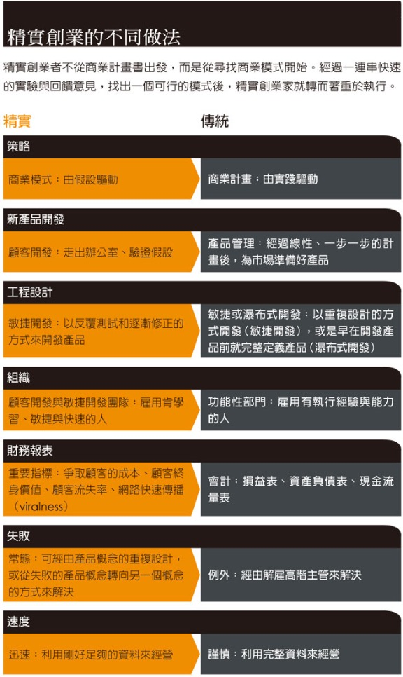
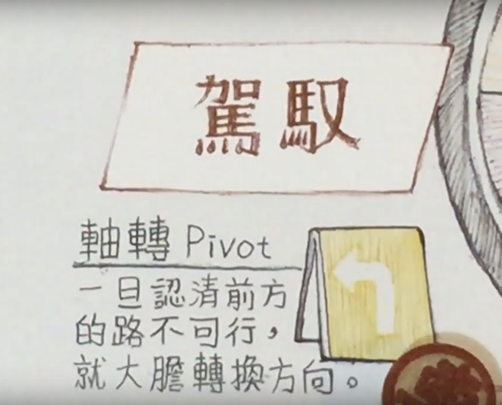
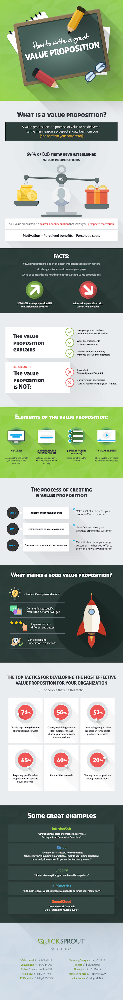

## 20181105#3: Planning Social Ventures I

### [Preview materials]

**→ Lean Startup:**

- [What is it?](https://youtu.be/_a3s0IXSuxY) (1:45 min)***
- [What is it? THE LEAN STARTUP METHODOLOGY](http://theleanstartup.com/principles)*
- [Creating the lean Startup (E. Ries)](https://www.inc.com/magazine/201110/eric-ries-usability-testing-product-development.html)

**→ Discovery-driven planning:**

- [Discover-driven planning: What is it?](https://hbr.org/1995/07/discovery-driven-planning) （[中文版點我](https://www.hbrtaiwan.com/article_content_AR0000165.html)）***
- [Discovery-driven planning: making Social Ventures work](https://hbr.org/2010/09/making-social-ventures-work)（[中文版：落實創業五大準則](https://www.hbrtaiwan.com/article_content_AR0000165.html)）
- [Customer discovery: How to build a startup](https://youtu.be/FRzz9JJ6iiI)* 

**→ Business Model Canvas:**

- [Business Model Canvas - what is it and why should I use it?](https://diytoolkit.org/tools/business-model-canvas/)*
- [Business Model Canvas - in detail](https://www.alexandercowan.com/business-model-canvas-templates/)*
- [How to Write a Great Value Proposition?](https://blog.hubspot.com/marketing/write-value-proposition)*

### [Suggestion readings]

- [假日書蟲：精實創業讀後感](https://holidaybookworm.blogspot.com/2017/02/the-lean-startup-eric-ries-lean-startup.html)***
- [哈佛商業評論：精實創業改變全世界](https://www.hbrtaiwan.com/article_content_AR0002324.html)***
- [創新拿鐵：用「設計思維」玩轉「精實創業」](http://startupbeat.hkej.com/?p=38149)***
- [創新拿鐵：創業圈當紅的精實創業，有哪3點迷思](https://startuplatte.com/2016/10/19/lean_startup/)***
- [有物報告：《精實創業》失敗越快，成功越近](https://yowureport.com/8453/)*
- [Cheers：三張圖，找出新獲利模式](https://www.cheers.com.tw/article/article.action?id=5068818)***

### [Notes]＊＊＊

#### 1. 精實創業

##### **精實創業：在反覆試驗中摸索前行**

「精實創業（Lean Startup）」，強調在面對高度不確定性的商業環境下，應該快速把「最小可行性產品」丟到市場驗證，然後藉由持續調整找出可獲利的商業模式。

2011年9月，矽谷創業家艾瑞克．萊斯（Eric Ries）發表「精實創業」（The Lean Startup）一書，創業圈從此有了另一番光景。推崇此一科學方法的創業家不再耗費數月研擬鉅細靡遺的營運計劃書，也不刻意追求功能完備的新產品，而是藉由重覆「製造—檢驗—學習」（Build-Measure-Learn）的歷程，推出「最小可行性產品」（Minimum Viable Product, MVP），進而搜集早期顧客意見然後反覆小幅調整，甚或進行關鍵「轉型」（Pivot），大幅改正創業初期的既定方向。

如今很多新創公司採用精實創業。套用Ries的話：「靠著人類直覺在充滿極度不確定性的情況下創造新產品與服務。」為了消除這種不確定性，他們採取「做就對了」（Just do it）的方法。公司可以藉由設定一連串的假設，並在這些假設之中發展出屬於自己的一套**商業模式圖（Business Model Canvas）**，藉此釐清帶給消費者與公司的價值，去創造出有別於混亂之中的秩序。

公司在進行產品開發前，應該事先問過上述那些問題，並實際走出辦公室與顧客接觸，這種方法被稱為**顧客發展（Customer Development）**。Ries說：「提早接觸顧客的目的不是為了獲得確切的答案。而是為了釐清潛在客戶的需求」。讓公司解決實際問題，並且針對需要的細節加以修改。

在這之後則是進行**敏捷開發（Agile Development）**，這種做法能讓管理者及時給予開發者幫助，在產品更新改良過程中增加人手以利開發。並且不斷針對客戶需求進行修正，做出原型再反覆測試，嘗試讓產品更加進步，藉此節省開發時間。此外，這種做法也能讓產品在被廣泛推出前，就已有穩定客群。

##### 萬一開頭就走錯！科學方法之外還需要同理心

以人為本的「設計思維」（Design Thinking）由享譽國際的創新設計公司IDEO執行長兼總裁提姆．布朗（Tim Brown）提出，原應用於產品設計，但隨著商業環境變得複雜，「設計思維」在種種演變下逐步融入企業文化與商業模式中，應用範圍也越加擴大，尤其面對諸如客戶體驗、情感聯繫等抽象問題時，往往能產生明顯效益。相較「精實創業」，「設計思維」顯得更為柔軟、開放，由同理心出發，帶點直覺，要企業家們再善解人意一些，透過訪談和觀察，站在不同角度仔細聆聽目標顧客的故事，進而尋求創新解決方法，真正地創建一個以客戶為中心的企業。新創企業藉由感性的「設計思維」挖掘目標顧客的潛在慾望，試著體會他們在消費時的真實情境，在此基礎上形成以客為本的創新想法後，快速敏捷地重複「製造－檢驗－學習」循環，盡快把「最小可行性產品」送至目標顧客手上，實際驗證商業假設，並從「失敗」中持續學習、快速成長。

- 軸轉（Pivot）是一種商業戰略假設的改變，什麼時候需要改變方向？通常新創很難面對軸轉，因此作者建議最好有定期的堅持/軸轉討論會。以下簡單列出幾個作者提出軸轉的變形。
  - 推進軸轉（Zoom in pivot），舊產品其中一項功能會被選出來做成新產品。
  - 拉遠軸轉（Zoom out pivot），舊產品的整個核心功能變成新產品的一項功能。
  - 顧客需求軸轉（Customer need pivot），原本提供的價值可能顧客不是很需要，但因為了解顧客，所以反而發現他們的其他需求。
  - 平台軸轉（Platform pivot） ，從應用軟體轉型為平台，或從平台轉型為應用軟體。
  - 企業架構軸轉（Business Architecture Pivot），利潤與貨量間的調整與轉型。
  - 其他的還有價值擷取軸轉（Value Capture Pivot）、成長引擎軸轉（Engine of Growth pivot）、通路軸轉（Channel Pivot）、科技軸轉（Technology pivot）等。

#### 2. 發現導向式規劃

- 若想在拉丁美洲、亞洲或非洲等地創業，但缺乏那些環境的可靠資料，就必須集結最好的模式與機制，隨時記下他們的各種假設。但最重要的是，必須根據一連串的檢查點，有系統地測試初步模式的每項假設，並做好隨時應變的準備，透過所謂的「發現導向式規劃（根據新發現來應變規畫）」（discovery-driven planning），以調整做法。如此一來，就能根據新出現的證據採取行動，而不是固執與盲目地追求不可行的目標（見麗塔．岡瑟．麥奎斯〔Rita Gunther McGrath〕和麥克米蘭合寫的〈應變式規畫〉）。
- 五大準則：
  - 準則1：界定事業的約略範圍（具體列出取消創業的條件、界定可接受的門檻、徹底檢視事業所處的經濟、國家、文化環境後，規畫事業的行動規範，這可能包括「不做賒賬銷售」、「不違反母國或地主國的法律」、「絕不行賄」等原則。）
   - 準則2：注意社會政治面
     在你開始前，必須仔細檢視重要的利害關係人、他們的角色，以及他們可提供的資源。找出受益者（可從事業獲利，但一開始可能存疑而不太願意支持的人）、潛在盟友（最有可能支持專案的人）、中立者（不太可能關心專案，但他們的支持可能是關鍵）、有意義的反對者（會因為專案成功而受害，有手段可阻礙專案進行的人）。有了這樣的分析，你就會知道如何動員支持者，並平息反對者。
   - 準則3：強調應變式規畫（時間軸、可能面臨的挑戰）
   - 準則4：規畫退出計畫
   - 準則5：預期無心造成的結果

#### 3. 商業模式九宮格

1. 目標客層：一個企業或組織所要服務的顧客群。 誰是我們最重要的顧客？ 我們為誰創造價值？ 
2. 價值主張：可以為特定的目標客層，創造出價值的整套產品與服務。 我們給消費者的價值是什麼？ 我們能幫助顧客解決什麼問題？ 我們提供給每個目標客層的，是什麼樣的產品與服務？
3. 通路：一家公司利用溝通、配送、銷售等通路，與顧客建立起來往的介面，目的是傳達公司的價值主張。 目標客層希望我們透過哪些通路與他們接觸？ 我們的通路如何整合？該如何配合顧客的例行狀況，整合這些通路？ 
4. 顧客關係：一家公司與特定的目標客層，所建立起來的關係型態。 哪些關係是我們已經建立的？要花多少成本？ 這些關係要如何融入我們的商業模式？ 
5. 收益流：成功地將價值主張提供給客戶後，從每個客層所產生的現金（收益扣除成本，所得到的利潤）。如果顧客是商業模式的心臟，收益流就是動脈。必須自問： 他們現在付錢購買的是什麼？現在如何付費？比較希望如何付費？ 
6. 關鍵資源：不同型態的商業模式，所需關鍵資源也不同，它可以是實體資源、財務資源、智慧資源或人力資源。 我們的價值主張、配銷通路、顧客關係、收益流，需要什麼樣的關鍵資源？ 
7. 關鍵活動：必須要有關鍵活動，一個企業才能創造並提出價值主張、進入市場、維繫顧客關係，賺取收益。 
8. 關鍵合作夥伴：要讓一項商業模式運作，所需要的供應商及合作夥伴網絡。 我們的關鍵夥伴∕供應商是誰？ 哪些關鍵資源是從合作夥伴處取得的？哪些關鍵活動是由合作夥伴執行的？ 
9. 成本結構：運作商業模式會產生的所有成本。 我們的商業模式中，最重要的既定成本是什麼？ 哪個關鍵資源最昂貴？哪個關鍵活動最燒錢？

#### 4. 價值主張

