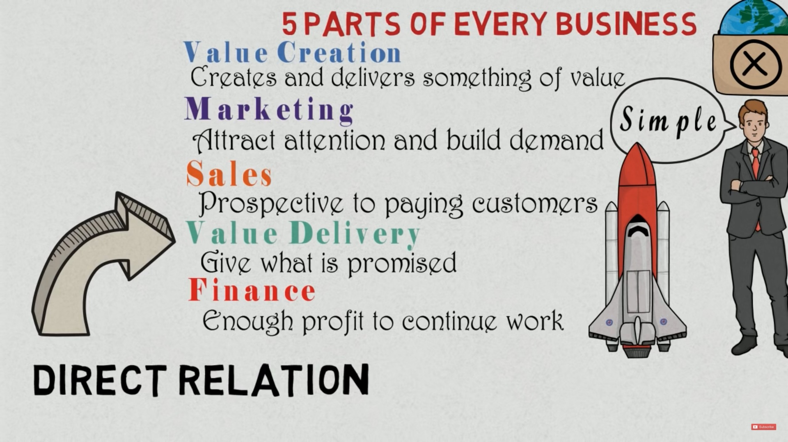

## 20181210#7: Communicating Social Ventures II

### [Preview materials]

**→ Benchmarking:**

- [What is benchmarking?](https://youtu.be/R6tJpyaFiQc) ***

- [Benchmarking: How to invent service? (by C. Bell)](https://drive.google.com/file/d/0B7jj5o_JrCMPZkN5bUFRbEhsOGc/view)

**→ Value creation:**

- [Value Creation and 5 Parts of Every Business](https://youtu.be/imlkWMwNOkk)***
- [Creating value is key to the future of marketing (by C. Ross)](https://drive.google.com/file/d/0B7jj5o_JrCMPalN5WlBycFJRLU0/view)

**→ Crowdsourcing:**

- [Crowdsourcing (by L. Zoref)](https://youtu.be/din2UVvRnGU)

**→ Persuasive marketing :**

- [3 ways to use the power of persuasion](https://www.entrepreneur.com/article/254661) 

- [6 principles of persuasive marketing](https://www.insites-consulting.com/6-principles-of-persuasive-marketing-how-to-influence-people/)（[中文版](https://www.smartm.com.tw/Article/31313339cea3)）*

### [Suggestion readings]

- [MBA智庫：標竿分析法](https://wiki.mbalib.com/zh-tw/标杆分析法)
- [深入人心的說服力行銷法，7個策略讓產品不銷自售](https://www.smartm.com.tw/Article/31313339cea3)

### [Notes]

#### 1. 標竿分析法

標竿/基準化分析法（英語：Benchmarking）又稱標竿測試/管理/學習，是指將自己企業的表現指標與業界最佳指標做比較。常見的指標包括品質、時間、花費等。標竿測試通過找出業界中最佳的幾個公司或產品並與自己比較來了解目標公司的表現，並且試圖解釋他者成功的原因。

##### 1.1 前言

在我國最早使用標竿學習觀念者，當推論語中，孔子所說的：「見賢思齊焉，見不賢而內自省也。」、「三人行，必有我師焉，擇其善者而從之，其不善者而改之。」

國際間最早使用「標竿學習（競爭標竿、尺標比較、水平對比）」（Benchmarking）一詞作為管理工具者，當屬美國全錄公司。1982年初，該公司察覺到他們在全美影印機市場佔有的比例，從百分之八十驟降至百分之十三，企業生存出現危機。為拯救危亡，公司推出「品質掛帥」（Leadership through Quality）的策略專案品質計畫；它是由員工參與、學習標竿及品質改進三項重要策略所構成，由於領導者貫徹執行，帶領公司走出困境，終於反敗為勝，並於1989年獲美國國家品質獎的榮銜，而他們所採用「學習標竿」的做法，也成為企業常用的管理工具。

##### 1.2 定義

標竿學習就其字意言，是尋找學習的對象，以他們既有成就為基準 ，透過合法管道學習，以「見賢思齊」的手段，達到改善自己經營體質之目的。換句話說，它是指一家公司可以就某一特定過程，將本身的績效與其他公司的績效相比較，然後學習其中績效最佳者的做法，以達到提升自己績效的目的。我們亦可從以下的標竿學習（Benchmarking）定義中，得知其意涵：

- Collins 英文字典將Benchmark/ Benchmarking解釋為「 固定對象的標記，諸如用石柱來說明高出海平面之高度，作為調查中的參考點」，有基準之意。
- 韋氏（Webster）字典將它解釋為：「標竿為一種調查的指標，做為預定的基本參考點，這個標準可以用測量或評價某些實務。」
- 美國生產力與品質中心（APQC）：「標竿學習是一項有系統、持續性的評估過程，透過不斷地將企業過程與世界上居領導地位之企業相比較，以獲得協助改進經營績效之資訊。」
- 美國全錄公司：「持續有系統地評估頂尖企業的一種過程，以確認最好的業務運作方式，並據以設定合理的自我表現目標。」
- 美國教育部：「持續地衡量其產品、服務及運作方式，並與最佳競爭者或產業界的領導者相比較。」

由此可知，標竿學習是一種向企業實務楷模學習的過程，它可以向同業學習，也可以向異業學習，這種學習過程要靠人來推動，惟有人人參與，標竿學習的策略才能成功。綜上所述，我們可將標竿學習歸納為下列幾個重點：

-  是一種廣受歡迎能促進進步的管理工具。
-  重視過程與實務。
-  可以辨識出最需改變的過程。
-  重在全員參與。
-  可比較自己公司的過程或績效與一流公司的過程或績效。
-  目標是找出成功的秘訣，然後應用在自己公司。

##### 1.3 類型

標竿學習是以「知己」的方式，來檢驗自己，也以「知彼」的方式，來瞭解競爭對手，從而得知，自己到底與競爭對手的差距有多少。一般來說，標竿學習因對象和範圍的不同可分成四類：

1. 內部標竿（Internal Benchmarking）：係指企業內各部門、工廠、分公司、間之某一類似作業過程或工作方法，彼此相互觀摩學習，找出組織內不同部門間的績效差異，進行改善。

2. 競爭標竿（Competitive Benchmarking）：係指向競爭對手學習，將其營運有關的重要項目，與競爭對手進行標竿研究比較，比較的項目包括：產品之品質、價格、生產/服務過程、績效等，擇優學習。

3. 機能標竿（Functional benchmarking）：它係針對某一機能或過程之改善目的而設。先定出某些企業機能領域，諸如：生產、行銷、財務、服務…等的績效衡量標準，而後尋求在此特定領域內表現卓越的其他組織，將它與企業本身比較，分析其作業過程之優點與績效差距，達到改善績效的目的。

4. 一般的標竿（Generic Benchmarking）：係指將創新的學習方法，運用到過程或策略的改善，它代表的意涵是專注於學習卓越的作業過程，不論其存在之行業或產業別。例如全錄公司向AT&T學習R/D，向美國快遞學習收款，向密立根公司學習員工提案制度等等。參考最佳者的作業系統，建立自己的功能目標，整合策略，使自己成為最佳者。

##### 1.4 重要觀念

欲期有效運用標竿學習作為管理工具，須先建立四項重要觀念，即：「全面品質觀」、「過程觀」、「衡量標準觀」與「學習觀」，茲略述如次：

-   全面品質觀：係指標竿學習的基本理念之一，在於達成顧客的全面滿意；
-   過程觀：係指標竿學習所涵蓋學習對象的作業過程，以及組織內部的運作流程與計劃流程；
-   衡量標準觀：係指標竿學習須訂出某些組織功能上共同績效衡量標準，作為比較之依據；
-   學習觀：係同時強調向他人學習與自我學習的精神。

我們須將以上四種觀念作為實施標竿學習的基本原則，不可僅將標竿學習簡化為向他人學習的方式而已。我們也要瞭解，應將標竿學習視為持續的學習過程，不斷地進行創新與改善來提升組織效能，以增強競爭優勢。

#### 2. 生意五部分

#### 3. 三種產品廣告

- 產品廣告（product advertising）：所要推廣的是廣告主的產品或服務。依廣告目的，可再區分告知式、說服式、與提醒式三種產品廣告：

（1）告知式廣告（informative advertising）：用於要推廣全新或經過改良的產品，增加消費者對產品的知曉與瞭解程度。許多訴求「最新配方」、「獨家技術」、「全球首發」的廣告，都屬於告知式廣告。

（2）說服式廣告（persuasive advertising）：為了加強品牌偏好、促進品牌轉換，刺激消費者欲望與購買等，會強調品牌或產品的特色與優點，多使用在產品成長期與成熟期。某些說服式廣告會以間接或直接指出自己比競爭品牌優秀，而成為比較式廣告（comparison advertising）。

（3）提醒式廣告（reminder advertising）：當品牌已經被多數目標消費者接受與肯定，並產生品牌忠誠度時，廣告的目的轉變為提醒消費者，避免消費者對其品牌印象有所模糊或淡忘。這類廣告常出現在產品成熟期、甚至是衰退期。
