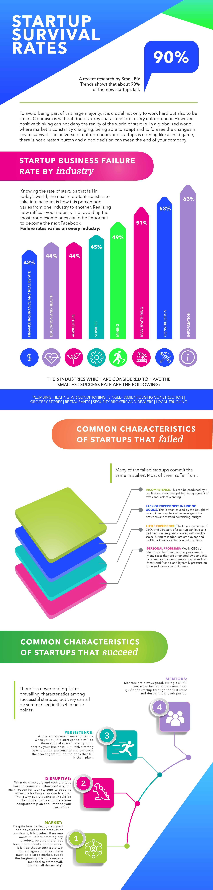

## 20181218\#8: Facing dilemmas/ failure of Social Ventures

### [Preview materials]

**→ Failure reasons &lessons:**

- [20 Reasons startup fail](https://www.entrepreneur.com/article/307724)*
- [Lessons from a failed entrepreneur](https://hbr.org/2013/02/lessons-from-a-failed-social-e)*
- [Social enterprises go bust all the time](https://www.theguardian.com/small-business-network/2018/mar/12/social-enterprises-go-bust-all-the-time-how-the-sector-is-tackling-its-image-problem)*
- [The Ultimate Startup Failure Rate](https://www.failory.com/blog/startup-failure-rate)
- [Why social impact startups are set to fail?](https://www.netimpact.org/blog/are-social-impact-start-ups-set-up-to-fail)
- [75% of startups fail, but it's no biggie](https://www.bizjournals.com/sanjose/blog/2012/09/most-startups-fail-says-harvard.html?page=all)

**→ Pivot &bouncing back:**

- [How 5 entrepreneurs bouncing back after failure](https://www.entrepreneur.com/article/225204)
- [7 Step Problem Solving (by E. Muzio)](https://youtu.be/bZXDGQSuF9I)
- [Pivot = A change in "strategy" without a change in "vision." (by E.Ries)](https://youtu.be/1hTI4z2ijc4) *
- [5 keys to success for social entrepreneurs (by L. Pareras)](https://youtu.be/Pl8c5ooHfWs)
- [A narrative approach to understanding venture failure stigmatization](http://neeley.tcu.edu/uploadedFiles/Academic_Departments/Management/Failed_not_finished.pdf)
- [Three rules for making a successful pivot](https://www.entrepreneur.com/article/235168)

### [Suggestion readings]

- [The Art of the Pivot](https://www.entrepreneur.com/slideshow/227215)
- [Do Pivots Matter? Yes, in Almost Every Case](https://www.entrepreneur.com/article/230754)
- [Pivot or Persevere? The Key to Startup Success](https://www.entrepreneur.com/article/220302)
- [能撐過前五年的新創公司只有1%—談創業家的七種死法](https://www.thenewslens.com/article/23818)

### [Notes]

#### 資訊圖表：新創生存率

