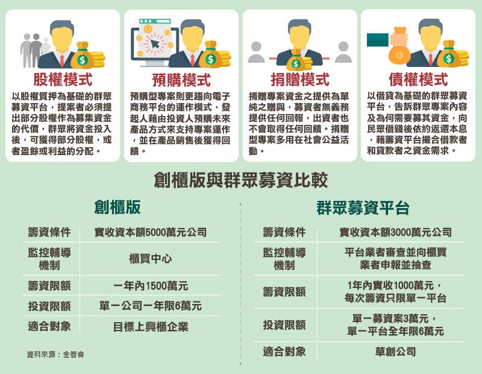

## 20181224#9: Funding Social Ventures

### [Preview materials]

**→ Crowdfunding:**

- [What is Crowdfunding?](https://youtu.be/8b5-iEnW70k)
- [Why are people motivated to post and fund projects on crowdfunding platforms?](https://www.researchgate.net/publication/261359489_Crowdfunding_Why_People_are_Motivated_to_Post_and_Fund_Projects_on_Crowdfunding_Platforms)*
- [The ten crowdfunding platforms of 2018](https://www.inc.com/larry-kim/op-10-crowdfunding-platforms-of-2018.html)

**→ Due Diligence:**

- [What is Due Diligence?](https://youtu.be/QJsjtvSMK9Y)***

- [BCG - M&A and Divestitures](https://www.bcg.com/capabilities/mergers-acquisitions-divestitures/due-diligence.aspx)

- [How to conduct Due Diligence?](https://blog.growthfunders.com/how-to-conduct-due-diligence-when-investing-in-start-ups)

- [Types of Due Diligence](https://corporatefinanceinstitute.com/resources/knowledge/deals/types-of-due-diligence/)*

- [Case Study Due Diligence](https://www.businesstimes.com.sg/companies-markets/roxy-pacific-not-proceeding-with-commercial-building-buy-after-due-diligence)

### [Suggestion readings]

- [群眾募資的現實面貌：不是集資，而是行銷](https://www.inside.com.tw/article/5897-the-reality-of-crowdfunding-is-not-raising-funds-but-marketing)***

- [【5 分鐘 Fintech】群眾募資是創新搖籃，更考驗民眾智慧](http://finance.technews.tw/2017/04/04/people-raise-money-is-an-innovative-entrepreneurial-angel-or-demon/)
- [MBA lib：財務盡責調查](https://wiki.mbalib.com/zh-tw/财务尽职调查)、[商業盡職調查](https://wiki.mbalib.com/zh-tw/商业尽职调查)
- [科技律師 (vi)：執行Due Diligence之專業與格調](https://www.ecounsel.net/zh/2018/03/17/科技律師-vi：執行due-diligence之專業與格調/)
- [募資 – 3, 了解Due Diligence (DD，投資風險評估) 的過程](https://startup20.org/2012/09/22/募資-3-了解due-diligence-dd，投資風險評估-的過程/)

### [Notes]

#### 1. 群眾募資/眾籌

- 群眾募資，又稱群眾集資、公眾集資、群募、公眾籌款或眾籌，是指個人或小企業通過網際網路向大群眾募資集資金的一種集資方式。群眾募資主要透過網際網路展示宣傳計劃內容、原生設計與創意作品，並與大眾解釋通過募集資金讓此作品量產或實現的計劃。支持、參與的群眾，則可藉由「購買」或「贊助」的方式，投入該計畫以實現計劃、設計或夢想。在一定的時限內，達到事先設定募資的金額目標後即為募資成功，開始使用募得的金錢進行計劃。

  

  

當台灣人在思考群眾募資的時候，我們要面對幾個現實：

- [群眾募資](https://www.inside.com.tw/2016/06/30/what-is-crowdfunding) 不會解決台灣新創團隊的資金問題，這必須要從資本市場去改變（美國也一樣）
- **更重要的是，** [**群眾募資**](https://www.inside.com.tw/2016/06/30/what-is-crowdfunding) **不會創造更好的新創公司，這必須要從環境去改革**
- 以台灣目前的新創環境與科技產業規模而言，過度於寄望群募而讓更多新創公司的資源投入 PR，無助於解決問題

最最最重要的是，

- 群募可以是非常重要的預購平台。台灣目前的科技產品多難銷至歐美國家，若能了解歐美群募平台的生態，台灣的 B2C 公司可以透過群募管道進入歐美市場。（以可行產品為前提

#### 2. 盡責調查

「Due diligence」是財務、投資與工程都常常使用的字，翻譯成「盡職調查」，通常就是在行動（買賣、投資）前要做好的各種準備。承襲我們台灣人喜歡說字母的習慣，這個步驟通常被簡稱為 DD。簡單說就是做重要決定之前應該要做的功課和檢核。原子筆要拿起來在旁邊的廢紙上寫幾個字看順不順，房子要看權狀看風水還要打聽會不會是凶宅… 這些，其實都是DD。”Due“ 原本指的是「適當的、合理的」，而 ”Diligence” 則是「注意、勤勉」；交易上用白話文講，就是「買之前要小心把貨看清楚、和賣方把話講清楚」。

> 編按：盡職調查（Due Diligence Investigation）又稱謹慎性調查，一般是指投資人在與目標企業達成初步合作意向後，經協商一致，投資人對目標企業一切與本次投資有關的事項進行現場調查、資料分析的一系列活動。其主要是在收購（投資）等資本運作活動時進行，但企業上市發行時，也會需要事先進行盡職調查，以初步瞭解是否具備上市的條件。

- “Due diligence” is just the fancy name given to the research process that is carried out prior to making an investment. It usually involves an investigation into a person or people, a business, or a marketplace.
